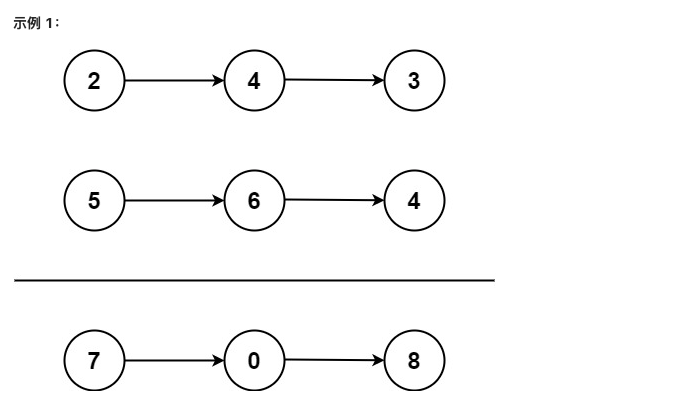

# 两数相加
[题目链接](https://leetcode.cn/problems/add-two-numbers/description/)

给你两个 非空 的链表，表示两个非负的整数。它们每位数字都是按照 逆序 的方式存储的，并且每个节点只能存储 一位 数字。

请你将两个数相加，并以相同形式返回一个表示和的链表。

你可以假设除了数字 0 之外，这两个数都不会以 0 开头。




输入：l1 = [2,4,3], l2 = [5,6,4]
输出：[7,0,8]
解释：342 + 465 = 807.
示例 2：

输入：l1 = [0], l2 = [0]
输出：[0]
示例 3：

输入：l1 = [9,9,9,9,9,9,9], l2 = [9,9,9,9]
输出：[8,9,9,9,0,0,0,1]

## 题解
```js
function ListNode(val) {
  this.val = val;
  this.next = null;
}

function addTwoNumbers(l1, l2) {
  let dummy = new ListNode(0); // 创建一个虚拟节点，用来保存结果链表的头节点
  let curr = dummy;
  let carry = 0;

  while (l1 !== null || l2 !== null) {
    let sum = carry; // 将和初始化为前一个进位
    if (l1 !== null) {
      sum += l1.val;
      l1 = l1.next;
    }
    if (l2 !== null) {
      sum += l2.val;
      l2 = l2.next;
    }
    carry = Math.floor(sum / 10); // 计算进位

    // 用数字和创建一个新节点，因为 let curr = dummy; 所以curr和dummy指向的是一个内存地址对象，
    // 下面2行的 curr.next指向的是同一个内存地址的新对象，多次循环后不断在新对象的下面创建新内存地址的对象，
    // 所以循环结束之后 dummy 变量会包含所有的对象
    curr.next = new ListNode(sum % 10); 
    curr = curr.next;
  }
  if (carry > 0) {
    curr.next = new ListNode(carry); // 如果有剩余进位，则创建一个新节点
  }
  return dummy.next; // 返回包含总和的结果链表
}

// Example usage:

// Create the first linked list: 2 -> 4 -> 3
let l1 = new ListNode(2);
l1.next = new ListNode(4);
l1.next.next = new ListNode(3);

// Create the second linked list: 5 -> 6 -> 4
let l2 = new ListNode(5);
l2.next = new ListNode(6);
l2.next.next = new ListNode(4);

let result = addTwoNumbers(l1, l2);

// Print the result: 7 -> 0 -> 8
while (result !== null) {
  console.log(result.val);
  result = result.next;
}
```

